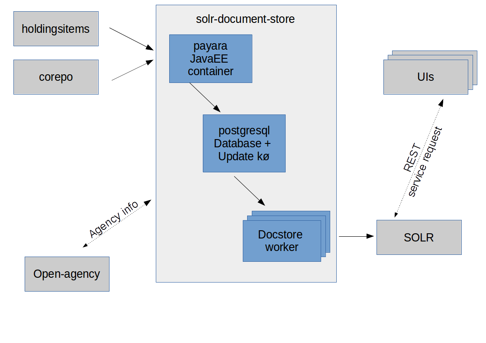

# Solr Document Store

Solr Document Store for Corepo &amp; HoldingsItems index Documents

## License

  SOLR Document Store
  Copyright (C) 2015 Dansk Bibliotekscenter a/s, Tempovej 7-11, DK-2750 Ballerup,
  Denmark. CVR: 15149043  

  SOLR Document Store is free software: you can redistribute it and/or modify
  it under the terms of the GNU General Public License as published by
  the Free Software Foundation, either version 3 of the License, or
  (at your option) any later version.

  SOLR Document Store is distributed in the hope that it will be useful,
  but WITHOUT ANY WARRANTY; without even the implied warranty of
  MERCHANTABILITY or FITNESS FOR A PARTICULAR PURPOSE.  See the

  GNU General Public License for more details.

  Please see [LICENSE](LICENSE) for furhter information.

## Purpose  

To populate and update a SOLR schema with bibliographic documents including holdings and misc. search keys.

## Overview

Solr Document Store reads data from corepo and holdingsitems. And maintains its own PostgreSQL database with Bibliographic Records and HoldingsItems attached to those. 

## Flow

When a Bibliographic item is updated the postgres database is updated and the key of the Bibliographic item is placed on an internal queue (implemented in postgres). The SOLR updater_ reads the queue and updates SOLR with the changes.

## Definitions

* Corepo Documents (corepo) 

  Holds bibliographic Documents at the Manifestation level 

* Holdings Items Documents (holdingsitems)

  Holds Holdings Documents fragments at the Item level.

# Technical setup

## Setup

See Dependencies below.

Clone repository.  
Run ./scripts/build-and-start-server.

## Dependencies

* Linux  
  Software is developed to run on Linux. Ubuntu was used during development.

* docker  
  User building source must be able to run docker (no sudo)

* postgresql  
  Integration tests expects a postgres database to be available. Build uses $USER as value for dbname, user and password

  Ex. jdbc:postgresql://localhost:5432/__myuser__?user=__myuser__&password=__myuser__

* Open-agency  
  Uses internal Open Agency URL duing tests  
  ( http://openagency.addi.dk/next_2.32/ )

## Modules

solr-document-store contains the following modules/directories:

* __scripts__  
  Contains a few scripts to ease life a bit.

* __doc__  
  Contains resources and other documentation

* __corepo-worker__  
  Read elements from corepo and holdingsitems and calls the internal REST services to handle changes.

* __gui__  
  Administration GUI implemented in React

* __queue__  
  Helper classes for the internal queue

* __service__  
  Contains services for updating the internal postgres database. All deployed on Payara.

* __solr-updater__  
  This is Docstore Worker. Reads elements from the internal queue and updates SOLR

## Open Agency integration

SOLR Document Store queries Open-Agency (libraryRules) for information on the Agencies. The following types of Agencies (libraries) are identified:

* __FBS__    
  Public library, using DBC managed Bibliographic records plus own updates.
  (CanUseEnrichments)

* __FBSchool__    
  School library - uses DBC managed Bibliographic records + additional School specific Bibliographic records, plus own updates.
  (CanUseEnrichments + "Skolebibiotek")

* __NonFBS__   
  Library maintaining own Bibliographic records only.

           
## JMeter 

The JMeter projects uses the following plugins from https://jmeter-plugins.org/wiki/PluginsManager/
   - Distribution/Percentile Graphs  https://jmeter-plugins.org/wiki/RespTimesDistribution/
  
           
## Testing 

